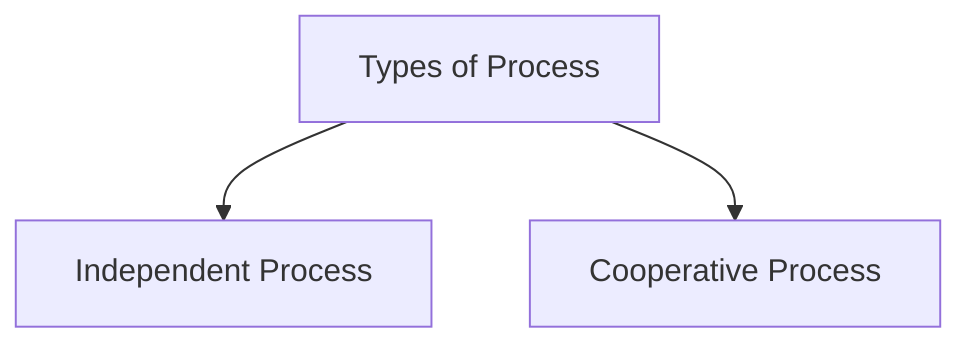
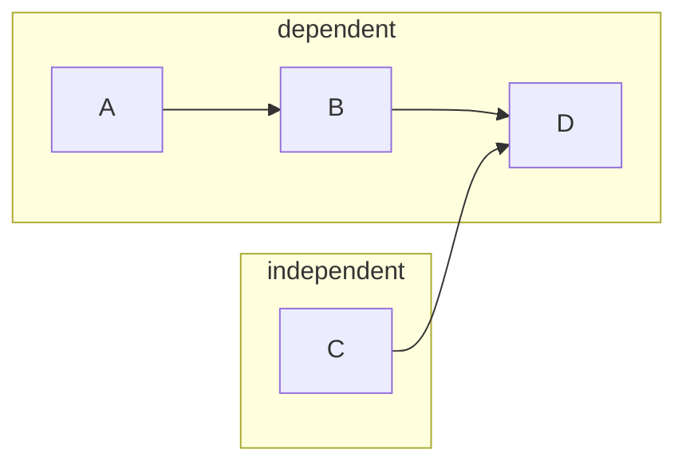
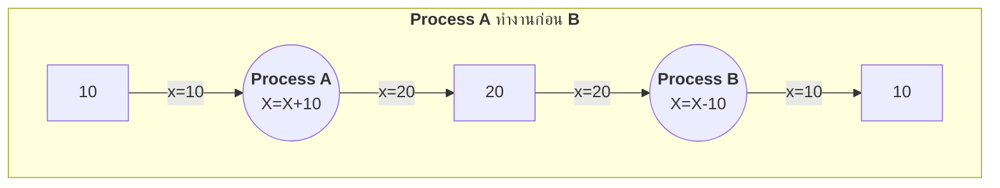
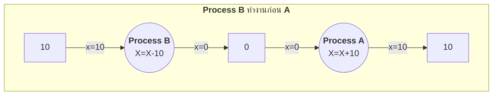
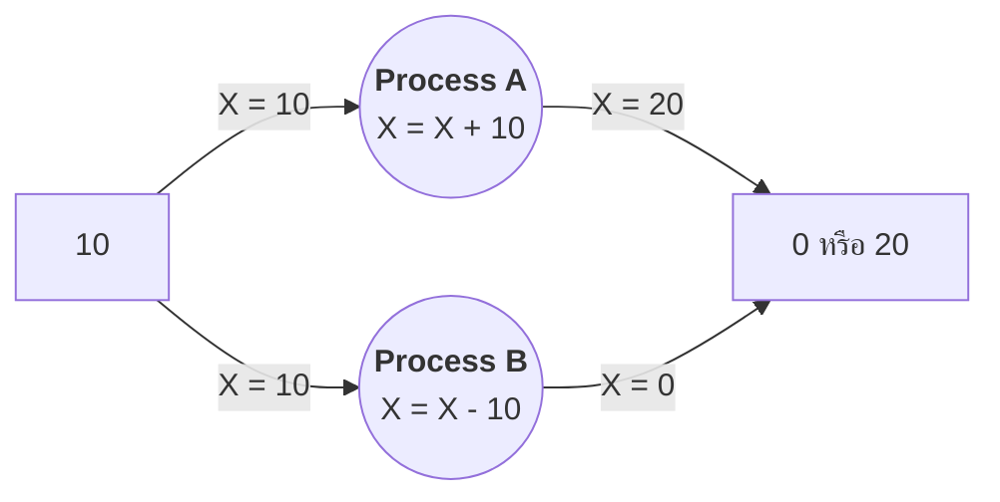
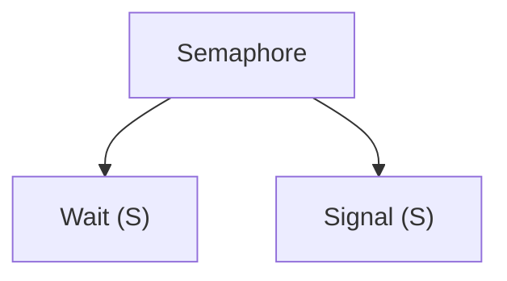
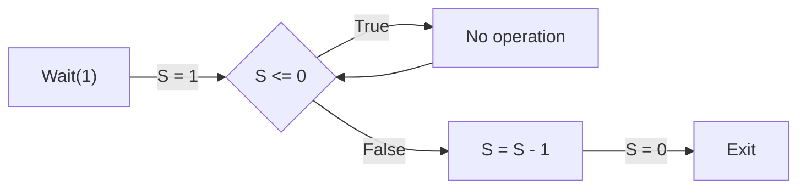
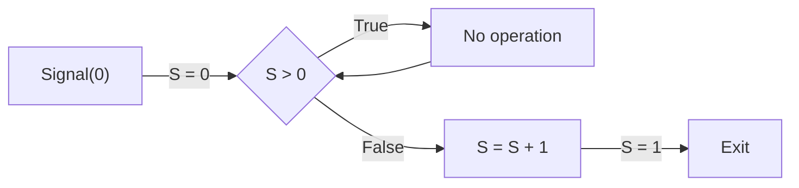

# Process Synchronization

---

# Process Synchronization

- ในระบบคอมพิวเตอร์ที่มีหน่วยประมวลผลเดียวแต่มีหลายโพรเซสทำงานอยู่ในระบบ โพรเซสต่าง 
ๆ สลับกันทำงานด้วยความถี่หลายครั้งต่อวินาที คล้ายกับว่าโพรเซสต่าง ๆ ทำงานไปพร้อม ๆ กัน

- เครื่องที่มีหน่วยประมวลผลมากกว่าหนึ่งหน่วยประมวลผล โพรเซสต่าง ๆ สามารถทำงานไปพร้อมกันได้จริงบน
หน่วยประมวลผลคนละตัวกัน สภาพเช่นนี้เรียกว่าภาวะพร้อมกัน (Concurrency)

- ระบบคอมพิวเตอร์ที่
ทำงานแบบมัลติโปรแกรมมิ่ง มีโพรเซสหลายโพรเซสทำงานพร้อมกัน โดยที่แต่ละโพรเซสอาจมีการทำงาน
เป็นอิสระต่อกัน หรือมีการทำงานที่ขึ้นต่อกัน ดังนั้นหากมีความต้องการที่จะเข้าใช้ทรัพยากรที่มีอยู่พร้อม
ๆ กัน เช่น ใช้หน่วยความจำตำแหน่งเดียวกันพร้อมกัน ทำให้เกิดปัญหาการเขียนอ่าน และสำหรับ
หน่วยความจำที่ใช้ร่วมกัน อาจทำให้ผลของการทำงานคลาดเคลื่อนจากที่ควรจะเป็น

---

# Types of Process

<div class="flex justify-center w-full h-full">



</div>

---

# Types of Process (2)

1. **Independent Process** คือ Process ที่ทำงาน โดยไม่มีการพึ่งพาอาศัย Process อื่น ทำงานอย่างอิสระ เมื่อ Process ทำงาน จะไม่ส่งผลกระทบต่อ Process อื่นๆ
2. **Cooperative Process** คือ Process ที่ทำงาน โดยมีการพึ่งพาอาศัย Process อื่น เมื่อ Process ทำงาน จะส่งผลกระทบต่อ Process อื่นๆ

<div class="flex justify-center w-full h-full">



</div>

---

# Critical Section Problem

- **Critical Section** เป็น Code ส่วนหนึ่งที่ Process จะทำงานได้ทีละ Process และใช้ทรัพยากรร่วมกัน เช่น ตัวแปร






---

# Critical Section Problem (2)

- **ถ้า Process A และ B ทำงานพร้อมกัน** จะเกิด **Race Condition**

<div class="flex justify-center">



</div>

---

# Solution for process synchronization (แนวคิดในการแก้ปัญหา)

<div class="flex gap-3">

<div>

```
do {
    Entry Section

        Critical Section

    Exit Section

        Remainder Section

} while(true);
```

</div>

<div>

- **Entry Section** จะทำหน้าที่ควบคุม (Lock) ไม่ให้ Process อื่นเข้ามาทำงาน
    - **Critical Section** คือส่วน Code ที่จะใช้ Shared Resource ร่วมกัน ในระหว่างที่ Process ใด Process หนึ่งทำงาน Process อื่นก็จะทำงานไม่ได้ 

- **Exit Section** คือถ้า Process ทำงานเสร็จแล้ว ก็จะ (Unlock) ให้ Process เข้าทำงานในส่วนของ Critical Section ได้
    - **Remainder Section** คือ Code ที่ไม่ได้มีการ Lock ทำให้ Process ไหนก็ได้สามารถทำงานได้

</div>

</div>


---

# Solution for process synchronization (2) 
- แนวคิดการแก้ปัญหา จะต้องคำนึงถึงปัจจัย 3 ข้อดังนี้

1. **Mutual Exclusion** คือ ถ้ามี Process กำลังทำงานอยู่ และทำงานในส่วน **Critial Section** จะไม่อนุญาติให้ Process อื่นเข้ามาทำในส่วน **Critical Section** ได้

2. **Progress** คือ ถ้ามี Process มากกว่า 1 ตัวร้องขอเข้าไปทำงานในส่วน **Critical Section** และในขณะนั้น **Critical Section** ไม่มี Process ไหนทำงานอยู่เลย ก็จะอนุญาติให้ Process เหล่านั้น เข้าไปทำงานทันที

3. **Bounded Waiting** คือถ้ามี Process ร้องขอเข้าไปทำงานในส่วน **Critical Section** จะต้องบอกได้ว่าจะต้องรออีกนานเท่าไร ถึงจะอนุญาติให้เข้าไปทำงานได้


---

# A solution tools

1. **Semaphore** คือเครื่องมือที่ใช้แก้ปัญหาเรื่อง **Process Synchronization** โดยแทนค่าด้วยตัวแปร S ที่เป็น type integer โดยแบ่งการทำงานเป็น 2 ส่วนหลักๆ คือ 
    - Wait(S)
    - Signal(S)
    
<div class="flex justify-center">


</div>


---

# Semaphore

1. **Wait** คือ เมื่อมี Process ร้องขอจะเข้าไปทำงานในส่วน **Critical Section** จะต้องมาเรียก Wait ก่อน 

```
wait(S){
    while(S <= 0);
        // no-operation
    S = S - 1;
}
```



---

# Semaphore (2)

2. Signal คือ เมื่อ Process ทำงานเสร็จแล้วก็จะ อนุญาติให้ Process อื่นเข้ามาทำงานต่อได้

```
signal(S){
    while(S > 0);
        // no-operation
    S = S + 1;
}
```



---

# Semaphore (3)

- ชนิดของ Semaphore

    1. **Counting semaphore** คือค่าของตัวแปร S ที่เป็น type int อยู่ในช่วงๆ ช่วงหนึ่ง ไม่ได้กำหนดตายตัว
    2. **Binary semaphore** คือค่าของตัวแปร S ที่เป็น type int ระหว่าง 0 กับ 1


---

# Semaphore (4)


<v-switch>

<template #0-1>

- ดังนั้น Solution ที่อธิบายก่อนหน้า

<div class="flex gap-3">

<div>


```
do {
    Entry Section

        Critical Section

    Exit Section

        Remainder Section

} while(true);
```

</div>

<div>


- **Entry Section** จะทำหน้าที่ควบคุม (Lock) ไม่ให้ Process อื่นเข้ามาทำงาน
    - **Critical Section** คือส่วน Code ที่จะใช้ Shared Resource ร่วมกัน ในระหว่างที่ Process ใด Process หนึ่งทำงาน Process อื่นก็จะทำงานไม่ได้ 

- **Exit Section** คือถ้า Process ทำงานเสร็จแล้ว ก็จะ (Unlock) ให้ Process เข้าทำงานในส่วนของ Critical Section ได้
    - **Remainder Section** คือ Code ที่ไม่ได้มีการ Lock ทำให้ Process ไหนก็ได้สามารถทำงานได้

</div>

</div>
</template>

<template #1-7>


- ดังนั้นเราจะเอาส่วนของ **Wait(S)** กับ **Signal(S)** มาครอบ **Critical Section** เพื่อป้องกัน **Race condition**

<div class="flex gap-3">

<div>

````md magic-move {at:2, lines: true}
``` {*|2|6}
do {
    Entry Section

        Critical Section

    Exit Section

        Remainder Section

} while(true);
```


``` {2|6|*}{lines: false}
do {
    wait(S);

        // Critical section

    signal(S);

        // Remainder section

} while(true);
```
````

</div>


<div>


- **Entry Section** จะทำหน้าที่ควบคุม (Lock) ไม่ให้ Process อื่นเข้ามาทำงาน

- **Exit Section** คือถ้า Process ทำงานเสร็จแล้ว ก็จะ (Unlock) ให้ Process เข้าทำงานในส่วนของ Critical Section ได้

</div>

</div>

</template>

</v-switch>

---

# การทำงานของ Semaphore จะเป็นดังนี้

1. เมื่อ Process P1 ขอทำงานใน **Critical Section** 

````md magic-move {at:0, lines: true}
``` {*|2}
do { // P1
    wait(S=1);

        // Critical section

    signal(0);

        // Remainder section

} while(true);
```


``` {2|3|4|5|6}{lines: true}
do { // P1
    wait(S=1){
        while(S<=0);
        S = S - 1;
    }
    // Critical section
    signal(S);

        // Remainder section

} while(true);
```

````

---

2. แล้วเริ่มทำงานไปสักพัก P2 จะมาขอทำงานก็ต้องรอ P1 ให้เสร็จก่อน


````md magic-move {at:0, lines: true}
``` {*|2}
do { // P2
    wait(S=0);

        // Critical section

    signal(0);

        // Remainder section

} while(true);
```


``` {2|3}{lines: true}
do { // P2
    wait(S=0){
        while(S<=0);
        S = S - 1;
    }
    // Critical section
    signal(S);

        // Remainder section

} while(true);
```

````

---

3. รอ P1 Unlock ด้วยการเรียก Signal เสร็จแล้ว P2 ก็จะทำงานต่อได้

````md magic-move {at:0, lines: true}

``` {*|6}
do { // P1
    wait(S=1);

        // Critical section

    signal(0);

        // Remainder section

} while(true);
```

``` {7|8|9|10|11}{lines: true}
do { // P1
    wait(S=1){
        while(S<=0);
        S = S - 1;
    }
    // Critical section
    signal(S=0){
        while(s>0);
        S = S + 1;
    }
    // Remainder section

} while(true);
```

``` {3|4|5|6|7}{lines: true}
do { // P2
    wait(S=1){
        while(S<=0);
        S = S - 1;
    }
    // Critical section
    signal(S);

        // Remainder section

} while(true);
```

``` {7|8|9|10|11|*}{lines: true}
do { // P2
    wait(S=1){
        while(S<=0);
        S = S - 1;
    }
    // Critical section
    signal(S=0){
        while(s>0);
        S = S + 1;
    }
    // Remainder section

} while(true);
```
````

---

# ข้อควรระวัง 

- **จะต้องไม่ให้ Process 2 ตัว ทำคำสั่ง Wait และ Signal บน Semaphore ตัวเดียวกัน ในเวลาเดียวกัน**

---

# Deadlock

- **Deadlock** คือ การที่มี Process มากกว่า 2 ตัว พยายามที่จะเข้าไปทำในส่วนของ **Critical Section** พร้อมๆกัน เช่นมีการเรียกใช้ตัวแปร 2 ตัวพร้อมๆกัน ในเวลาเดียวกัน

<div class="flex gap-3">


<div class="w-1/2">
<table>
<tbody>
<tr>
<td>P0</td>
<td>P1</td>
</tr>
<tr>
<td>wait(Q);</td>
<td>wait(S);</td>
</tr>
<tr>
<td class="text-red-500">wait(S);</td>
<td class="text-green-500">wait(Q);</td>
</tr>
<tr>
<td class="">...</td>
<td class="">...</td>
</tr>
<tr>
<td class="text-green-500">signal(S);</td>
<td class="text-red-500">signal(Q);</td>
</tr>
<tr>
<td class="">signal(Q);</td>
<td class="">signal(S);</td>
</tr>
</tbody>
</table>
</div>

<div class="w-1/2">

- ให้ S และ Q เป็น semaphore ที่มีค่าเริ่มต้นเป็น 1
- เมื่อ P0 ใช้คำสั่ง wait(Q) จะต้องรอให้ P1 ใช้คำสั่ง signal(Q) จึงจะไปต่อได้
- เนื่องจากคำสั่ง signal(Q) และ signal(S) จะไม่มีวันได้ทำงาน P0 และ P1 อยู่ใน
ภาวะติดตาย
</div>
</div>