import { Steps, Card, Tabs, TabItem, LinkButton } from "@astrojs/starlight/components";

<LinkButton href={"/cos3105/print/lab1"} icon="seti:pdf" target={"_blank"}>Print</LinkButton>

:::note
กระบวนการหลังจากเปิดคอมพิวเตอร์ขึ้นมาจะเป็นดังรูป
:::

## การทำงานของ Boot Loader 

<Card>
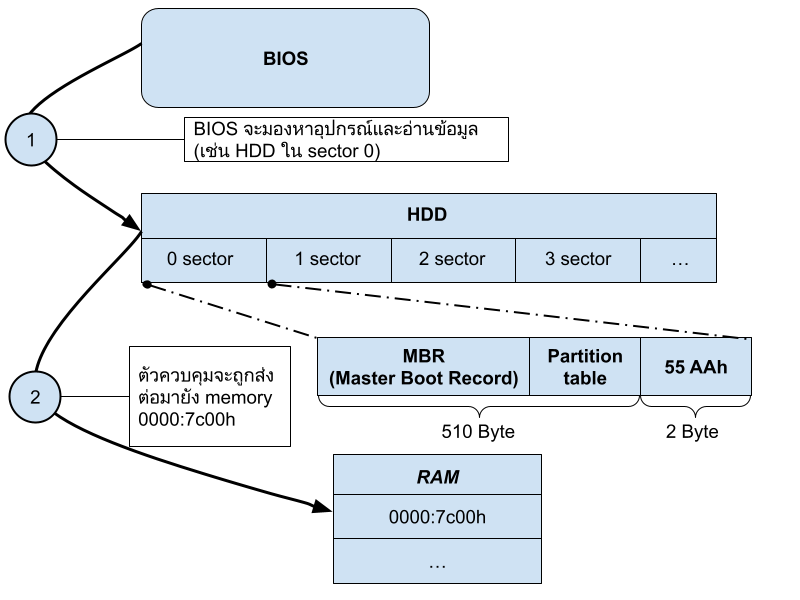

<center>
**รูป 1: แสดงการโหลดโปรแกรม boot loader จากอุปกรณ์ไปยัง memory**
</center>

:::caution
โปรแกรม boot loader จะมีขนาดไม่เกิน 512 Byte เพราะใน 1 sector ของ HDD มีขนาด 512 Byte
:::

</Card>

## ติดตั้ง Bochs Emulator

<Card>
<center>

</center>

<Steps>
1. โหลด bochs emulator โดยไปที่ https://sourceforge.net/projects/bochs/files/bochs/2.8/Bochs-win64-2.8.exe/download
2. ติดตั้ง bochs emulator
3. เพิ่ม path ของโปรแกรมไปใน environment variables 
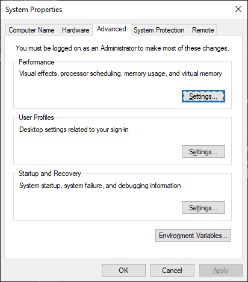
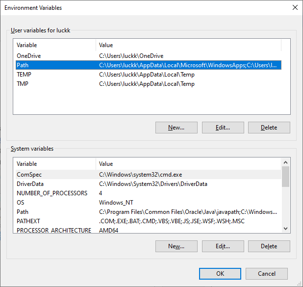
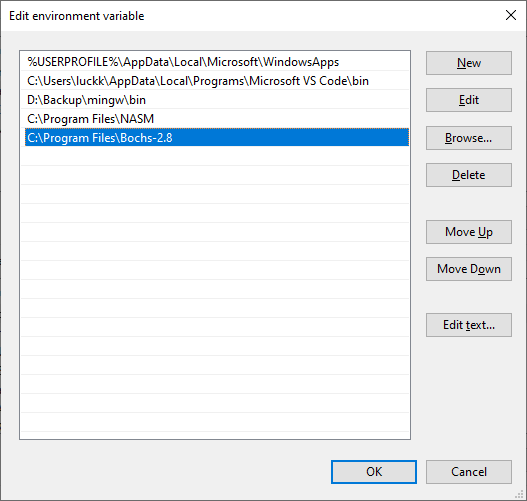
</Steps>
</Card>
## ติดตั้ง NASM Compiler

<Card>
<Steps>
1.  โหลดโปรแกรม NASM โดยโหลดที่ https://www.nasm.us/pub/nasm/releasebuilds/2.16.03/win64/nasm-2.16.03-installer-x64.exe

2. ติดตั้ง NASM

3. เพิ่ม path ของโปรแกรมไปใน environment variables
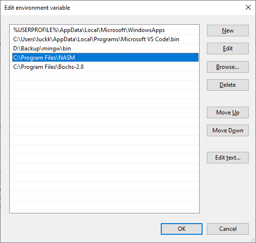
</Steps>

**Example Boot Loader**
```asm
[org 7c00h]          	; BIOS will load us to this address
mov ax, 0b800h       	; Console memory is at 0xb8000
                        ; set up a segment
mov es, ax           	; for the start of the console text.
;
; Let's clear the screen....
;
xor di, di           	; Start at beginning of screen
mov cx, 80*25        	; Number of chars in the screen
mov al, ' '          	; Space character
mov ah, 0fh          	; Color (white on black)
repne stosw          	; Copy!


mov byte [es:0], 'H' 	; Write an 'H'
mov byte [es:1], 08ch


sleep:
hlt                  	; Halts CPU until the next external  
                        ;interrupt is fired
jmp sleep            	; Loop forever

times 510-($-$$) db 0	; Pad to 510 bytes
dw 0aa55h            	; Add boot magic word to mark us                
                        ; as bootable

```

:::note
การพิมพ์ตัวอักษรออกสู่หน้าจอ จะมีข้อกำหนดดังนี้

อ้างอิงไปที่ memory address ในกรณีนี้ อ้างอิงไปที่ memory address ของ register es โดยโครงสร้าง memory จะแบ่งเป็น segment:offset

1 ตัวอักษรจะใช้ 2 byte โดย byte แรกแทนตัวอักษร และ byte สองแทน attribute นั่นก็คือ สีของข้อความและพื้นหลัง โดยเก็บในรูปฐาน 16

```sh frame="none"
       Bit 76543210
           ||||||||
           |||||^^^-สีตัวอักษร
           ||||^----สีตัวอักษร+ความสว่าง
           |^^^-----สีพื้นหลัง
           ^--------สีพื้นหลัง OR ทำให้กระพริบ
```

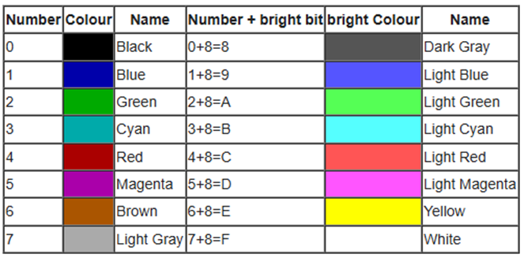

```sh frame="none"
ตัวอย่าง 8c = 1000 1100
            7654 3210
```
:::

</Card>

## การทำ Boot image

<Card>

<Steps>
1. นำโค๊ดด้านบนไปใส่ในไฟล์ boot.asm
2. compile ไปเป็น .bin ไฟล์ 
   ```ps
   nasm -f bin boot.asm boot.bin
   ```

3. สร้างไฟล์ .bochsrc
   ```bash frame="none"
    ata0-master: type=disk, path="boot.bin", mode=flat, cylinders=1, heads=1, spt=1
    boot: disk
    megs: 128
   ```
4. กดรัน <kbd>bochs</kbd> + <kbd>Enter</kbd>
    ```ps
    bochs
    ```

    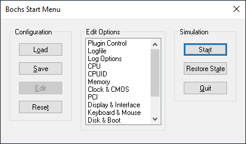

    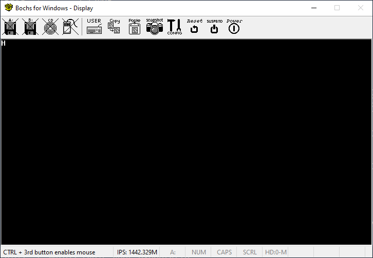
</Steps>

</Card>

## ติดตั้ง Virtual Box

<Card>
<Steps>
1. ติดตั้ง Virtual Box https://download.virtualbox.org/virtualbox/7.1.4/VirtualBox-7.1.4-165100-Win.exe
2. download https://drive.google.com/file/d/1f8esR9U6tHWqP3cBJAGBROHnHuwpO8Zx/view?usp=sharing
3. แตกไฟล์ rar
</Steps>
</Card>

## เพิ่ม DOS6 ลงใน Virtual Box

<Card>
<Steps>
1. เปิด Virtual Box แล้วกด Add
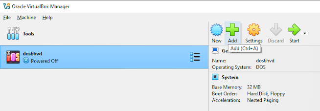
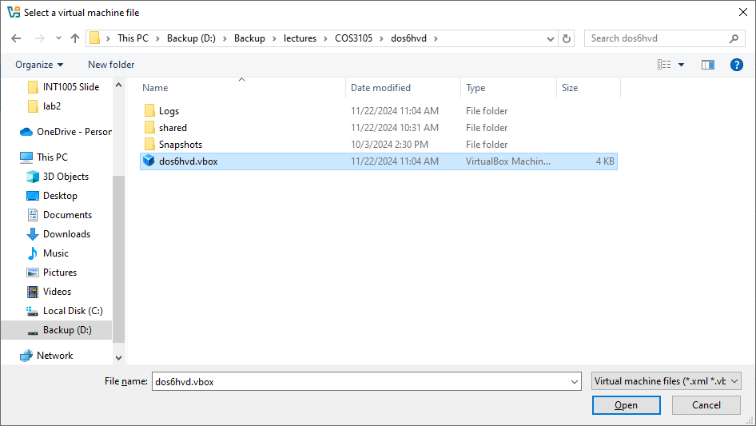
2. กด Open
3. กด Start จะรัน DOS6 ขึ้นมา
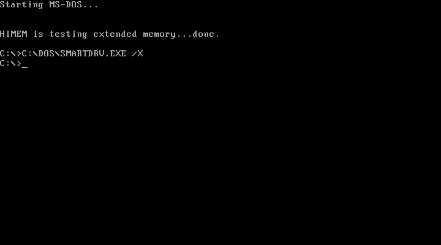
</Steps>
</Card>

## ประเภทของ Interrupt

:::note
- **Hardware Interrupts**: เกิดจากฮาร์ดแวร์ เช่น คีย์บอร์ด, เมาส์, พอร์ต I/O
- **Software Interrupts**: เกิดจากซอฟต์แวร์ เช่น การเรียกใช้ system call ผ่านคำสั่ง int ใน Assembly
:::

## ตัวอย่างของ System Call


<Card>
**ตัวอย่าง System Call ที่เรียกผ่าน Library ของภาษา C**
:::caution[คำเตือน]
ตัวอย่างอันนี้จะใช้ได้ทั้ง Linux, Windows หรือ DOS
:::

<Tabs>
<TabItem label="Linux, Windows, DOS">
```c
#include <stdio.h>
int main(void) {
  printf("hello, world!\n"); //จะไปเรียก systemcall
  return 0;
}
```
</TabItem>

<TabItem label="Linux">
**ตัวอย่าง 1**
```c
#include <unistd.h>
int main(void) {
  write(1, "hello, world!\n", 14);
  return 0;
}
```
**ตัวอย่าง 2**
```c
#include <unistd.h>
#include <sys/syscall.h>
int main(void) {
  syscall(SYS_write, 1, "hello, world!\n", 14);
  return 0;
}

```
</TabItem>
</Tabs>

</Card>

## ตัวอย่างของ System Call ใน DOS6

:::note
จากตัวอย่างด้านล่างนี้จะใช้ **ภาษา C** และใช้ **inline assembly**  ซึ่ง syntax นี้จะใช้ได้เฉพาะ **Borland CPP 3.1**
:::

:::tip
ดูข้อมูลเพิ่มเติมเกี่ยวกับ Interrupt ชนิดต่างๆ ได้จาก https://www.thaiall.com/assembly/interrupt.htm
:::

### Interrupt 21

<Card>
<Tabs>
<TabItem label="ฟังก์ชั่น 2">
```c ins={4,5}
#include <stdio.h>
int main(){
    asm {
          mov ah, 0x2     // ใช้ function 2 ส่งอักขระไปยังจอภาพ
          mov dl, 'a'        // ส่งตัวอักษร ‘a’ ไปจอภาพ
          int 21h
    }
   return 0;
}


```
</TabItem>
<TabItem label="ฟังก์ชั่น 9">
```c ins={6,7}
#include <stdio.h>
int main(){
    
   char far* greetings = “Hello World!$”;
   asm {
        lds dx, greetings // ส่งข้อความไปยังจอภาพ
        mov ah, 0x9        // ใช้ฟังก์ชั่น 9
        int 21h
   }
   return 0;
}
```
</TabItem>
</Tabs>
</Card>

### Interrupt 10

:::note
**Interrupt 10** เป็น interrupt ของ **bios** สำหรับจัดการ **Video** กับ **Screen**
:::

<Card>
```c
#include <stdio.h>
int main(){  	
  asm {       
    mov ah,0x9      //ฟังก์ชั่น 9 พิมพ์ตัวอักษร
    mov al,'b'       // ตัวอักษร b
    mov bh,0x0       // 
    mov bl,0xcc      // สีของตัวอักษร
    mov cx,10        //จำนวนตัวอักษร
    int 10h	
  }   
  return 0;
}

```
</Card>


### Interrupt 8

:::note
**Interrupt 8** เป็น interrupt ของ **bios** เป็น **System Timer**
:::

<Card>

```c
#include <stdio.h>
#include <dos.h>
#include <bios.h>
#include <conio.h>
void far interrupt (*oldint_8h)(void);
void far interrupt timer_hook(void);
int m=0;
int t=0;
int active=0;
char far* vga = (char far*)0xB8000000; // แสดงผลออกการ์ดจอ
void far interrupt timer_hook(void){
  int i;
  if(active==1){
  (*oldint_8h)();
  return;
  }
  t++;
  m++;
  if(t>10){
  active = 1;
  t = 0;
  for(i=0;i<200;i+=2){
    *(vga + i) = m%2==0? 'A' : 'B';
    *(vga + i + 1) = 0x7;
  }
  active=0;
  }
  (*oldint_8h)();
}
int main(void){
  int ch;
  asm {
   mov ax, 0x3;
   int 10h
  }
  oldint_8h = getvect(0x8);
  setvect(0x8, timer_hook);
  while(ch!='z'){
    ch = getch();
    putch(ch);
  }
  setvect(0x8, oldint_8h);
  asm{
  mov ah,0
  mov al,3
  int 10h
  }
  return 0;
}

```
</Card>