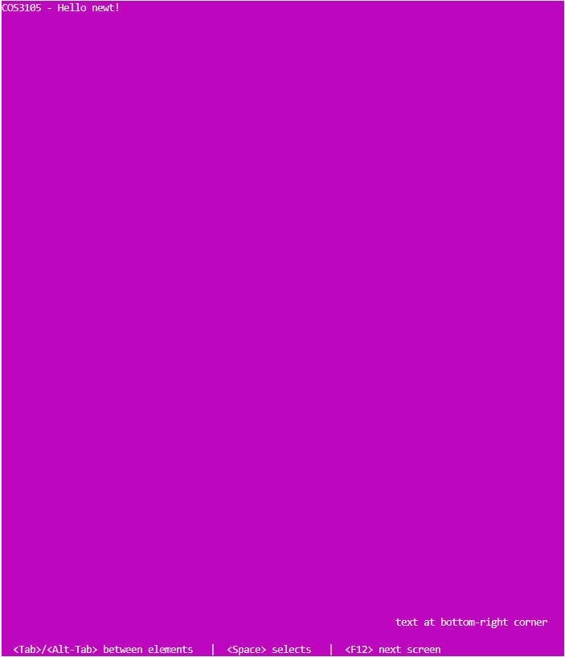
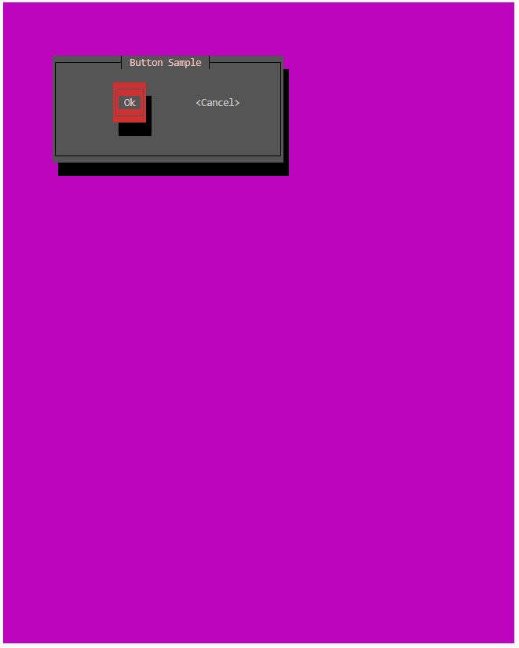
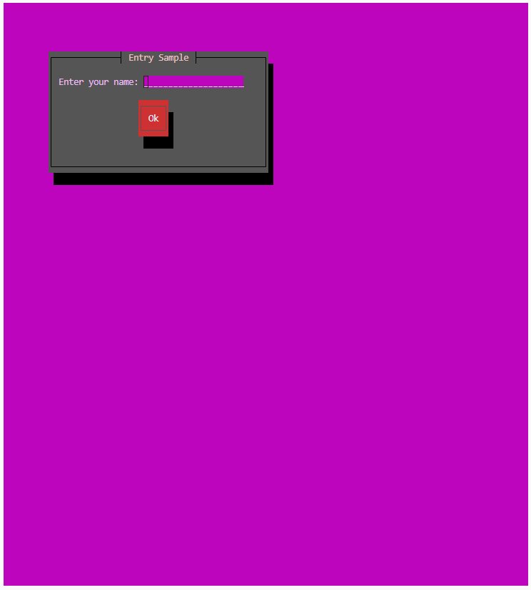
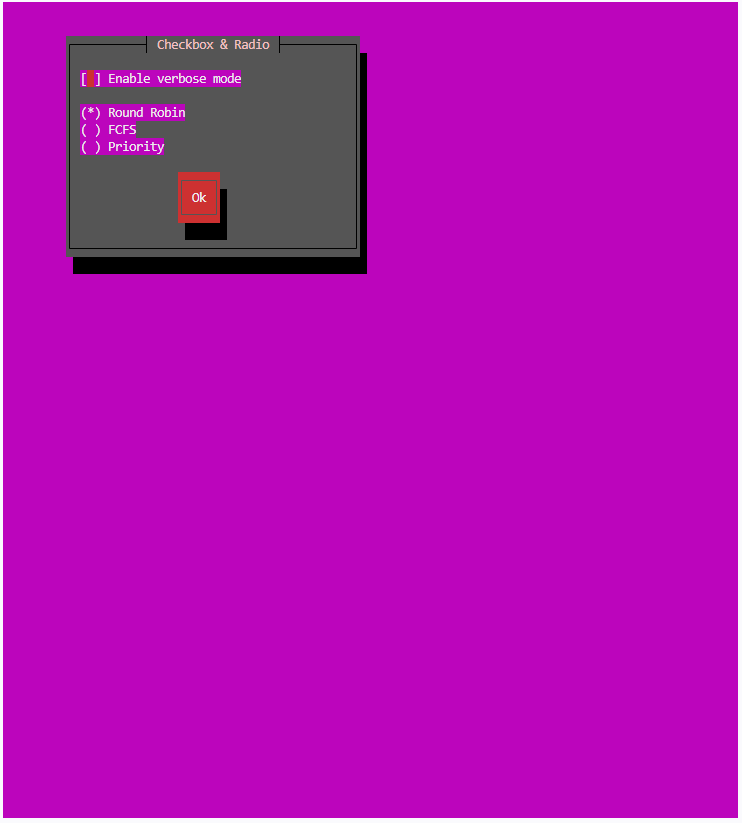
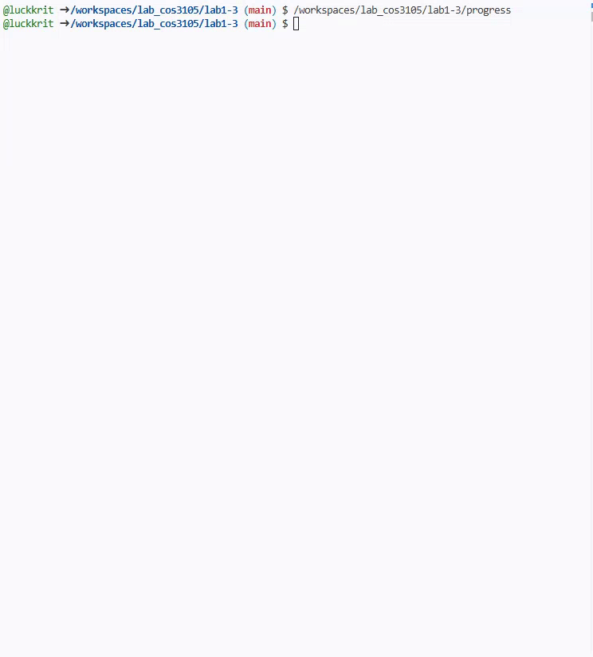
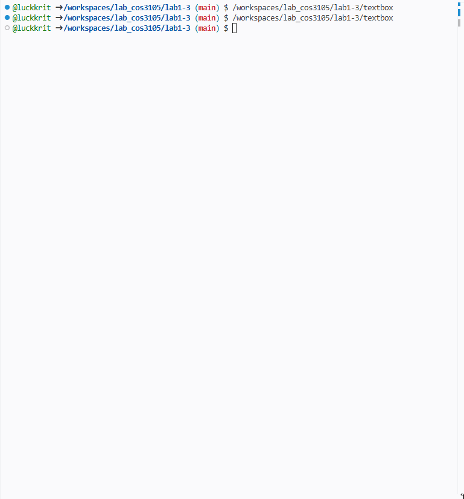
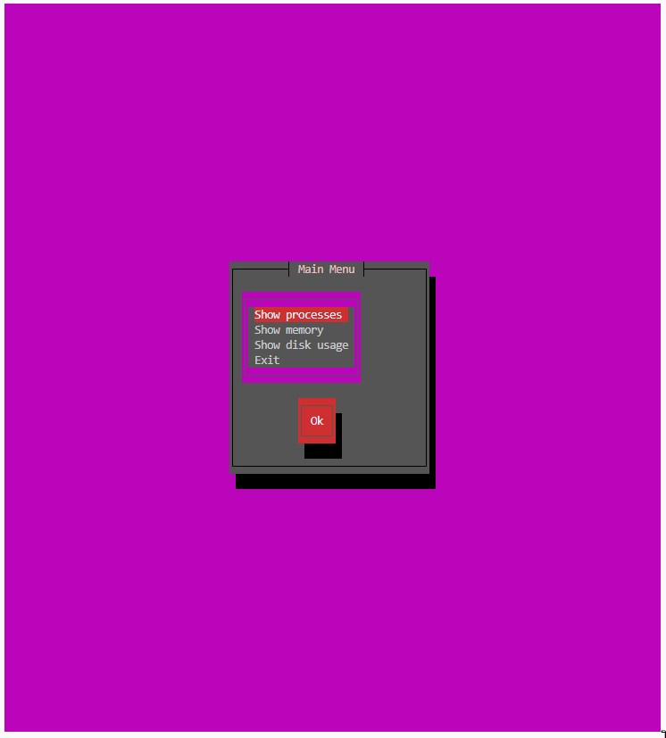

## newt คืออะไร?

**newt** เป็นไลบรารีภาษา C สำหรับสร้าง **Text User Interface (TUI)** — คือ UI ที่มีหน้าต่าง ปุ่ม ช่องกรอกข้อความ ฯลฯ แต่ทำงานบน **terminal** ล้วน ๆ ไม่ต้องมี GUI

newt ถูกพัฒนาโดย Red Hat เพื่อใช้ในโปรแกรมติดตั้ง Red Hat Linux (ตัว installer สีน้ำเงิน ๆ ที่เห็นตอนลง Linux แบบ text mode นั่นแหละ) จุดเด่นคือ **เล็ก เรียบง่าย และเขียนตามลำดับได้เหมือนโปรแกรม C ปกติ**

### ทำไมต้องเรียนในวิชา OS?

1. newt ทำงานติดกับ terminal โดยตรง — ได้เห็นแนวคิด **raw mode**, การจัดการ terminal state และ signal (`SIGTSTP`) ซึ่งเป็นเรื่องของ OS ตรง ๆ
2. เป็นภาษา C ล้วน compile ด้วย gcc — ต่อยอดกับงาน systems programming (process, socket) ได้ทันที เช่น เอาไปทำหน้าจอให้ mini project ของเรา
3. ง่ายกว่า ncurses มาก — เหมาะกับการเริ่มต้น TUI

### จุดสำคัญที่ต้องรู้ก่อนเริ่ม

newt **ไม่ใช่ event-driven** เหมือน GUI framework ทั่วไป (GTK, Qt, WinForms) — เราไม่ต้องเขียน event handler แล้วรอให้ระบบเรียก แต่เขียนโค้ดตามลำดับปกติ:

```
สร้างหน้าต่าง → สร้าง component → รัน form (รอ user กรอก) → อ่านค่า → ไปต่อ
```

ดังนั้นโปรแกรม command line เดิม ๆ ที่ใช้ `printf`/`scanf` สามารถแปลงเป็น newt ได้โดย **ไม่ต้องเปลี่ยน control flow** เลย

ข้อจำกัดที่ต้องรู้:

- หน้าต่างทำงานเป็น **stack** — หน้าต่างที่เปิดทีหลังต้องปิดก่อน (ทุกหน้าต่างเป็น modal dialog)
- user สลับไปมาระหว่างหน้าต่างไม่ได้ ใช้ได้เฉพาะหน้าต่างบนสุด
- รับ input จาก keyboard เท่านั้น (ไม่มี mouse)

---

## การติดตั้ง

บน Ubuntu / WSL2:

```bash
sudo apt update
sudo apt install libnewt-dev
```

ตรวจสอบว่าติดตั้งสำเร็จ:

```bash
ls /usr/include/newt.h
```

### การ compile

ต้อง link ไลบรารีด้วย `-lnewt` เสมอ:

```bash
gcc hello.c -o hello -lnewt
```

---

## โปรแกรมแรก: Hello newt

ทุกโปรแกรม newt มีโครงเหมือนกัน: เริ่มด้วย `newtInit()` และจบด้วย `newtFinished()`

```c
// hello.c
#include <newt.h>
#include <unistd.h>   // sleep()

int main(void) {
    newtInit();     // เริ่มระบบ newt + สั่ง terminal เข้า raw mode
    newtCls();      // เคลียร์หน้าจอ (ไม่บังคับ แต่ทำแล้วสวยกว่า)

    // เขียนข้อความลงบน root window (พื้นหลัง)
    newtDrawRootText(0, 0, "COS3105 - Hello newt!");

    // ค่าติดลบ = นับจากขอบอีกด้าน (-1 คือบรรทัด/คอลัมน์สุดท้าย)
    newtDrawRootText(-30, -3, "text at bottom-right corner");

    // help line = บรรทัดล่างสุดของจอ, NULL = ใช้ข้อความ default ของ newt
    newtPushHelpLine(NULL);

    newtRefresh();  // บังคับให้วาดหน้าจอทันที
    sleep(3);

    newtFinished(); // คืนสภาพ terminal กลับเป็นปกติ *สำคัญมาก*
    return 0;
}
```

```bash
gcc hello.c -o hello -lnewt
./hello
```



> ⚠️ **ถ้าลืม `newtFinished()`** — terminal จะค้างอยู่ใน raw mode พิมพ์อะไรก็เพี้ยน ให้พิมพ์คำสั่ง `reset` แล้วกด Enter เพื่อกู้คืน

### ฟังก์ชันพื้นฐานที่ใช้บ่อย

| ฟังก์ชัน | หน้าที่ |
|---|---|
| `newtInit()` | เริ่มระบบ newt (เรียกก่อนเสมอ) |
| `newtCls()` | เคลียร์หน้าจอ |
| `newtFinished()` | คืนสภาพ terminal (เรียกก่อนจบโปรแกรมเสมอ) |
| `newtRefresh()` | บังคับวาดหน้าจอทันที (ปกติ newt วาดเฉพาะตอนรอ input) |
| `newtWaitForKey()` | หยุดรอจนกว่าจะกดปุ่มอะไรก็ได้ |
| `newtBell()` | ส่งเสียง beep |
| `newtDrawRootText(left, top, text)` | เขียนข้อความบนพื้นหลัง |
| `newtPushHelpLine(text)` / `newtPopHelpLine()` | จัดการบรรทัดช่วยเหลือด้านล่าง (เป็น stack) |

> 💡 สังเกต convention ของ newt: พิกัดส่งเป็น **(left, top)** คือ **x มาก่อน y** เสมอ และขนาดส่งเป็น **(width, height)**

---

## หน้าต่าง (Windows)

มี 2 วิธีเปิดหน้าต่าง:

```c
// เปิดหน้าต่างกลางจอ
int newtCenteredWindow(int width, int height, const char *title);

// เปิดหน้าต่างระบุตำแหน่งเอง
int newtOpenWindow(int left, int top, int width, int height, const char *title);
```

ปิดหน้าต่าง (ปิดได้เฉพาะหน้าต่างบนสุด — จำได้ไหม? มันเป็น stack):

```c
void newtPopWindow(void);
```

---

## Components และ Forms

ทุกอย่างที่แสดงบนจอใน newt เรียกว่า **component** (ปุ่ม, label, ช่องกรอก, checkbox, listbox ฯลฯ) ทุก component มี type เดียวกันหมดคือ `newtComponent`

**Form** คือ component พิเศษที่ทำหน้าที่ "รวบรวม" component อื่นเข้าด้วยกัน ขั้นตอนมาตรฐานคือ:

```c
newtComponent form, b1;

form = newtForm(NULL, NULL, 0);            // 1. สร้าง form (3 พารามิเตอร์นี้ให้ใส่แบบนี้ไปก่อน)
b1 = newtButton(10, 1, "Ok");              // 2. สร้าง component
newtFormAddComponents(form, b1, NULL);     // 3. เอา component ใส่ form (ปิดท้ายด้วย NULL)

// หรือ ถ้ามี component อื่นๆ เช่น b2, b3, b4
newtFormAddComponent(form, b2);
newtFormAddComponent(form, b3);
newtFormAddComponent(form, b4);


newtRunForm(form);                         // 4. รัน form — โปรแกรมหยุดรอ user ตรงนี้
newtFormDestroy(form);                     // 5. คืน memory ของ form + ทุก component ข้างใน
```

`newtRunForm()` จะคืน control กลับมาเมื่อ user กดปุ่ม (button) หรือกด **F12** (hot key default = ปุ่ม Ok)

---

## ปุ่ม (Buttons)

มี 2 แบบ: ปุ่มเต็ม (สวยแต่กินที่ 3 บรรทัด) กับปุ่ม compact (บรรทัดเดียว)

```c
newtComponent newtButton(int left, int top, const char *text);
newtComponent newtCompactButton(int left, int top, const char *text);
```

### ตัวอย่างเต็ม: หน้าต่าง + ปุ่ม

```c
// buttons.c
#include <newt.h>
#include <stdlib.h>   // NULL

int main(void) {
    newtComponent form, b1, b2;

    newtInit();
    newtCls();

    newtOpenWindow(10, 5, 40, 6, "Button Sample");

    b1 = newtButton(10, 1, "Ok");
    b2 = newtCompactButton(24, 2, "Cancel");

    form = newtForm(NULL, NULL, 0);
    newtFormAddComponents(form, b1, b2, NULL);

    newtRunForm(form);      // กด Tab สลับปุ่ม, Enter/Space เลือก

    newtFormDestroy(form);
    newtFinished();
    return 0;
}
```

ลองรันแล้วกด **Tab** เพื่อสลับ focus ระหว่างปุ่ม



---

## Label และ Entry Box

- **Label** = ข้อความนิ่ง ๆ user แก้ไม่ได้
- **Entry box** = ช่องให้ user พิมพ์ข้อความ

```c
newtComponent newtLabel(int left, int top, const char *text);

newtComponent newtEntry(int left, int top, const char *initialValue,
                        int width, const char **resultPtr, int flags);
char *newtEntryGetValue(newtComponent co);
```

> 📌 เอกสารเก่า ๆ เขียน `resultPtr` เป็น `char **` แต่ newt เวอร์ชันปัจจุบัน (0.52.x บน Ubuntu) ใช้ `const char **` — ถ้าประกาศเป็น `char *` จะโดน warning `-Wincompatible-pointer-types`

flags ของ entry ที่ใช้บ่อย:

| Flag | ความหมาย |
|---|---|
| `NEWT_FLAG_SCROLL` | พิมพ์ยาวเกินความกว้างช่องได้ (ช่องจะ scroll) |
| `NEWT_FLAG_HIDDEN` | ซ่อนข้อความที่พิมพ์ (เหมาะกับ password) |
| `NEWT_FLAG_RETURNEXIT` | กด Enter ในช่องนี้แล้ว form จบทันที |

### ตัวอย่าง: รับชื่อจาก user

```c
// entry.c
#include <newt.h>
#include <stdio.h>

int main(void) {
    newtComponent form, label, entry, button;
    const char *entryValue;   // ต้องเป็น const char * (ดูหมายเหตุด้านบน)

    newtInit();
    newtCls();

    newtOpenWindow(10, 5, 42, 8, "Entry Sample");

    label  = newtLabel(1, 1, "Enter your name:");
    entry  = newtEntry(18, 1, "", 20, &entryValue,
                       NEWT_FLAG_SCROLL | NEWT_FLAG_RETURNEXIT);
    button = newtButton(17, 3, "Ok");

    form = newtForm(NULL, NULL, 0);
    newtFormAddComponents(form, label, entry, button, NULL);

    newtRunForm(form);
    newtFinished();

    printf("Hello, %s!\n", entryValue);

    /* ต้องใช้ค่า entryValue ให้เสร็จก่อนค่อย destroy form
       เพราะ newtFormDestroy จะ free memory ของ string นี้ด้วย */
    newtFormDestroy(form);
    return 0;
}
```

> ⚠️ **กับดักสำคัญ**: pointer ที่ได้จาก `resultPtr` หรือ `newtEntryGetValue()` ชี้ไปยัง memory ภายในของ newt — เมื่อเรียก `newtFormDestroy()` แล้ว pointer นั้นจะใช้ไม่ได้ทันที (dangling pointer!) ถ้าจะเก็บค่าไว้ใช้ต่อ ให้ `strdup()` ก่อน destroy




---

## Checkbox และ Radio Button

### Checkbox

กด Space เพื่อสลับสถานะ ค่า default คือ `' '` (ไม่เลือก) กับ `'*'` (เลือก)

```c
newtComponent newtCheckbox(int left, int top, const char *text,
                           char defValue, const char *seq, char *result);
char newtCheckboxGetValue(newtComponent co);
```

### Radio Button

เลือกได้ทีละ 1 ตัวในกลุ่ม — การจัดกลุ่มใช้พารามิเตอร์ `prevButton`: ตัวแรกใส่ `NULL` ตัวถัดไปใส่ radio button ก่อนหน้า

```c
newtComponent newtRadiobutton(int left, int top, const char *text,
                              int isDefault, newtComponent prevButton);
newtComponent newtRadioGetCurrent(newtComponent setMember);
```

### ตัวอย่าง

```c
// choices.c
#include <newt.h>
#include <stdio.h>

int main(void) {
    newtComponent form, checkbox, rb[3], button;
    char cbValue;
    int i, picked = -1;

    newtInit();
    newtCls();

    newtOpenWindow(10, 3, 40, 11, "Checkbox & Radio");

    checkbox = newtCheckbox(1, 1, "Enable verbose mode", ' ', NULL, &cbValue);

    rb[0] = newtRadiobutton(1, 3, "Round Robin",    1, NULL);   // ตัวแรก = NULL
    rb[1] = newtRadiobutton(1, 4, "FCFS",           0, rb[0]);  // ชี้ตัวก่อนหน้า
    rb[2] = newtRadiobutton(1, 5, "Priority",       0, rb[1]);

    button = newtButton(15, 7, "Ok");

    form = newtForm(NULL, NULL, 0);
    newtFormAddComponent(form, checkbox);
    for (i = 0; i < 3; i++)
        newtFormAddComponent(form, rb[i]);
    newtFormAddComponent(form, button);

    newtRunForm(form);
    newtFinished();

    /* หาว่า radio ตัวไหนถูกเลือก — ต้องทำก่อน destroy form */
    for (i = 0; i < 3; i++)
        if (newtRadioGetCurrent(rb[0]) == rb[i])
            picked = i;

    newtFormDestroy(form);

    printf("scheduler picked: %d\n", picked);
    printf("verbose: %s\n", cbValue == '*' ? "on" : "off");
    return 0;
}
```



---

## Scale (Progress Bar)

เหมาะกับงาน OS มาก เช่น แสดงความคืบหน้าตอน copy ไฟล์ หรือรอ process ทำงาน

```c
newtComponent newtScale(int left, int top, int width, long long fullValue);
void newtScaleSet(newtComponent co, unsigned long long amount);
```

`fullValue` คือค่าที่ถือว่า "เต็ม 100%" เช่น ขนาดไฟล์เป็น byte แล้วเรียก `newtScaleSet()` อัปเดตเรื่อย ๆ ด้วยจำนวน byte ที่ copy ไปแล้ว

### ตัวอย่าง: progress bar จำลอง

```c
// progress.c
#include <newt.h>
#include <unistd.h>

int main(void) {
    newtComponent form, scale, label;
    int i;

    newtInit();
    newtCls();

    newtCenteredWindow(40, 5, "Working...");

    label = newtLabel(1, 1, "Copying file:");
    scale = newtScale(1, 3, 36, 100);   // เต็มที่ 100

    form = newtForm(NULL, NULL, 0);
    newtFormAddComponents(form, label, scale, NULL);
    newtDrawForm(form);                 // วาด form โดยไม่รอ input

    for (i = 0; i <= 100; i += 5) {
        newtScaleSet(scale, i);
        newtRefresh();                  // ต้อง refresh เอง เพราะไม่ได้รอ input
        usleep(100000);                 // 0.1 วินาที
    }

    newtFormDestroy(form);
    newtFinished();
    return 0;
}
```

สังเกตว่าตัวอย่างนี้ใช้ `newtDrawForm()` + `newtRefresh()` แทน `newtRunForm()` — เพราะเราไม่ได้รอ input จาก user แต่ต้องการอัปเดตหน้าจอเอง (จำได้ไหมว่า S-Lang จะวาดจอเฉพาะตอนรอ input เท่านั้น)




---

## Textbox

ใช้แสดงข้อความยาว ๆ พร้อมตัดบรรทัดอัตโนมัติ

```c
newtComponent newtTextbox(int left, int top, int width, int height, int flags);
void newtTextboxSetText(newtComponent co, const char *text);

// เวอร์ชันสะดวก: reflow (จัดบรรทัดให้สวย) + สร้าง textbox ในคำสั่งเดียว
newtComponent newtTextboxReflowed(int left, int top, char *text, int width,
                                  int flexDown, int flexUp, int flags);
int newtTextboxGetNumLines(newtComponent co);
```

### ตัวอย่าง: Textbox มี scrollbar

```c
// textbox.c
#include <newt.h>
#include <stdlib.h>

int main(void) {
    // 1. เริ่มต้นระบบ Newt
    newtInit();
    newtCls();

    // กำหนดข้อความยาวๆ สำหรับแสดงผล
    const char *long_text = 
        "Welcome to the Newt Textbox demo. Newt is a programming library for text-mode user interfaces. "
        "It is based on the slang library. This specific component is a Textbox, which is incredibly useful "
        "for displaying long paragraphs of text, readmes, licenses, or logs in a terminal window. "
        "Notice how the text wraps dynamically based on the width provided, and how the scrollbar appears "
        "on the right when the text exceeds the component's visible height.";

    // 2. สร้าง Form หลัก
    newtComponent form = newtForm(NULL, NULL, 0);

    // 3. สร้าง Textbox แบบธรรมดา (ระบุกว้าง 50 สูง 6 ตัวอักษร)
    // ใช้ธง WRAP (ตัดบรรทัด) และ SCROLL (มีแถบเลื่อนด้านข้าง)
    newtComponent label1 = newtLabel(2, 1, "=== Standard Textbox (with Scrollbar) ===");
    newtComponent textbox1 = newtTextbox(2, 2, 50, 6, NEWT_FLAG_WRAP | NEWT_FLAG_SCROLL);
    newtTextboxSetText(textbox1, long_text);

    // 4. สร้าง Textbox แบบ Reflowed (จัดย่อหน้าและคำนวณความสูงให้อัตโนมัติ)
    newtComponent label2 = newtLabel(2, 9, "=== Reflowed Textbox (Auto-height) ===");
    
    // newtTextboxReflowed จะรับข้อความธรรมดาแล้วแปลงการจัดรูปเล่มให้พอดีกับความกว้าง
    // flexDown และ flexUp ตั้งเป็น 0 คือไม่ยืดหยุ่นเกินความจำเป็น
    newtComponent textbox2 = newtTextboxReflowed(2, 10, (char *)long_text, 50, 0, 0, NEWT_FLAG_WRAP);

    // 5. สร้างปุ่ม OK เพื่อกดปิดโปรแกรม
    newtComponent button = newtButton(22, 16, "OK");

    // 6. เพิ่ม Component ทั้งหมดเข้าไปใน Form
    newtFormAddComponents(form, label1, textbox1, label2, textbox2, button, NULL);

    // 7. รัน Form และรอจนกว่าผู้ใช้จะกดปุ่ม OK หรือปุ่ม Enter
    newtRunForm(form);

    // 8. คืนหน่วยความจำและปิดหน้าจอระบบ Newt
    newtFormDestroy(form);
    newtFinished();

    return 0;
}
```

flags: `NEWT_FLAG_WRAP` (ตัดบรรทัดอัตโนมัติ), `NEWT_FLAG_SCROLL` (เลื่อนดูได้ — จะกว้างขึ้น 2 ตัวอักษรเพราะมี scrollbar)



---

## Listbox

component ที่ซับซ้อนที่สุดของ newt — แสดงรายการให้ user เลือก

แต่ละรายการใน listbox เป็นคู่ **(text, key)**:
- **text** = ข้อความที่แสดง
- **key** = `void *` อะไรก็ได้ที่ใช้ระบุรายการนั้น (ส่วนใหญ่ใช้ int แปลงเป็น pointer หรือ pointer ไปยัง struct)

```c
newtComponent newtListbox(int left, int top, int height, int flags);
int newtListboxAppendEntry(newtComponent co, const char *text, const void *data);
void *newtListboxGetCurrent(newtComponent co);
```

flags ที่ใช้บ่อย: `NEWT_FLAG_SCROLL`, `NEWT_FLAG_BORDER`, `NEWT_FLAG_RETURNEXIT`, `NEWT_FLAG_MULTIPLE` (เลือกหลายรายการ)

### ตัวอย่าง: เมนูเลือกคำสั่ง

```c
// listbox.c
#include <newt.h>
#include <stdio.h>
#include <stdint.h>

int main(void) {
    newtComponent form, list, button;
    intptr_t choice;

    newtInit();
    newtCls();

    newtCenteredWindow(30, 12, "Main Menu");

    list = newtListbox(1, 1, 6, NEWT_FLAG_BORDER | NEWT_FLAG_RETURNEXIT);
    newtListboxAppendEntry(list, "Show processes",  (void *) 1);
    newtListboxAppendEntry(list, "Show memory",     (void *) 2);
    newtListboxAppendEntry(list, "Show disk usage", (void *) 3);
    newtListboxAppendEntry(list, "Exit",            (void *) 4);

    button = newtButton(10, 8, "Ok");

    form = newtForm(NULL, NULL, 0);
    newtFormAddComponents(form, list, button, NULL);

    newtRunForm(form);

    choice = (intptr_t) newtListboxGetCurrent(list);

    newtFormDestroy(form);
    newtFinished();

    printf("You picked menu item: %ld\n", (long) choice);
    return 0;
}
```




---

## สรุป Pattern มาตรฐานของโปรแกรม newt

```c
#include <newt.h>

int main(void) {
    newtInit();
    newtCls();

    /* --- ทำซ้ำได้เรื่อย ๆ --- */
    newtCenteredWindow(w, h, "title");   // 1. เปิดหน้าต่าง

    newtComponent form = newtForm(NULL, NULL, 0);
    // 2. สร้าง component ต่าง ๆ แล้ว add เข้า form
    newtFormAddComponents(form, ..., NULL);

    newtRunForm(form);                   // 3. รอ user

    // 4. อ่านค่าจาก component *ก่อน* destroy!

    newtFormDestroy(form);               // 5. คืน memory
    newtPopWindow();                     // 6. ปิดหน้าต่าง
    /* ------------------------ */

    newtFinished();
    return 0;
}
```

ข้อควรระวัง 3 อันดับแรก:

1. **ลืม `newtFinished()`** → terminal พัง (แก้ด้วยคำสั่ง `reset`)
2. **อ่านค่า entry/radio หลัง `newtFormDestroy()`** → dangling pointer / ค่าขยะ
3. **ปิดหน้าต่างไม่เรียงตาม stack** → หน้าจอวาดผิด

---

{/* ## แบบฝึกหัด

1. **Login window** — สร้างหน้าต่างที่มี entry 2 ช่อง (username และ password — ช่อง password ใช้ `NEWT_FLAG_HIDDEN`) พร้อมปุ่ม Login และ Cancel เมื่อกด Login ให้พิมพ์ username ออกทาง stdout
2. **Scheduler picker** — สร้างเมนู radio button ให้เลือก scheduling algorithm (FCFS / SJF / RR / Priority) แล้วแสดงผลการเลือก
3. **Fake installer** — สร้าง progress bar ที่วิ่งจาก 0 → 100% พร้อม label ที่เปลี่ยนข้อความทุก 25% (hint: `newtLabelSetText()` — ระวังข้อความใหม่ต้องยาวไม่น้อยกว่าข้อความเก่า ไม่งั้นตัวอักษรเก่าค้าง)
4. **(ท้าทาย) เมนู 2 ชั้น** — จากตัวอย่าง listbox ให้เปิดหน้าต่างใหม่ตามเมนูที่เลือก (แสดงผลลัพธ์อะไรก็ได้ + ปุ่ม Back) แล้ววนกลับมาที่เมนูหลักจนกว่าจะเลือก Exit — ฝึกการใช้หน้าต่างแบบ stack

--- */}

## อ้างอิง

- Erik Troan, *Writing Programs Using newt*, v0.31 (2003)
- man pages: `man newt` (ถ้าติดตั้ง `libnewt-dev` แล้ว ดู header ได้ที่ `/usr/include/newt.h`)
- newt ทำงานบนไลบรารี S-Lang ของ John E. Davis (จัดการการวาดหน้าจอระดับล่าง)