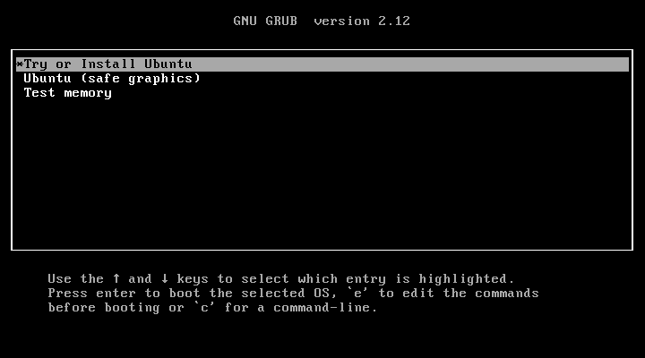

import { Image } from 'astro:assets';
import { Steps } from "@astrojs/starlight/components";
import { Tabs, TabItem } from '@astrojs/starlight/components';
import im1 from '../../../assets/images/new_vm.png';

:::note
เรียนรู้คำสั่งเกี่ยวกับ **Process** โดยใช้ **ภาษา C** และ **ระบบปฏิบัติการ Ubuntu**
:::

## Download Ubuntu

<Steps>
  1. Download Ubuntu 24.04.1 LTS :
  [https://ubuntu.com/download/desktop/thank-you?version=24.04.1\&architecture=amd64\&lts=true](https://ubuntu.com/download/desktop/thank-you?version=24.04.1&architecture=amd64&lts=true)
  2. ตรวจสอบค่า sum ของ ISO File ใน Powershell:
</Steps>

```ps title="Powershell - Check SUM SHA256"
Get-FileHash C:\Users\xxxx\Downloads\ubuntu-24.04.1-desktop-amd64.iso -Algorithm SHA256 | Format-List
```

:::caution[ค่า sum ควรมีค่าเท่ากับ]
**C2E6F4DC37AC944E2ED507F87C6188DD4D3179BF4A3F9E110D3C88D1F3294BDC**
:::

## ติดตั้ง Ubuntu
<Steps>

  3. ติดตั้ง Ubuntu 24.04.1 LTS บท VirtualBox <Image src={im1} alt="New VM" loading="eager" /> 
  4. ตรง Name ใส่ Ubuntu 24.04.1  
  5. ตรง Folder ก็ตามค่าเริ่มต้นไป 
  6. ตรง ISO Image กดปุ่ม Other  
  7. หาไฟล์ ISO ที่ Download มา  
  8. แล้วกด Open 
  9. ติ๊กถูก Skip Unattended Installation 
  10. ตรง Hardware เปลี่ยน Base memory เป็น 4096 mb 
      :::danger[ระวัง]
      minimum requirements ของ Ubuntu 24.04.1 คือ 4GB ถ้าตั้งน้อยกว่านั้นตอนติดตั้งจะค้างได้
      :::
  11. กดปุ่ม Finish แล้ว Virtual Box จะรันหน้าต่างขึ้นมา
  12. กด Enter เลือก \*Try or Install Ubuntu  
  13. จะโหลด Ubuntu ขึ้นมาดังรูป  
  14. ระบบจะติดตั้ง Ubuntu กด Next  
  15. กด Next  
  16. กด Next  
  17. กด Next  
  18. กด Next  
  19. กด Next  
  20. กด Next  
  21. กด Next  
  22. ตรง Your name ใสชื่อตัวเรา และตรง Password ให้ตั้งค่าตามที่เราต้องการ แล้วกด Next  
  23. กด Next  
  24. กด Install  
  25. ระบบจะติดตั้ง Ubuntu  
  26. ระบบจะให้เรา Reboot
  27. Login เข้ามาจะเจอหน้า Welcome ให้กด Next ไปเรื่อยๆ 
  28. ให้กด Next 
  29. ให้กด Next 
  30. ให้กด Finish 

</Steps>

## ติดตั้ง C Compiler
<Steps>
1. ไปที่ Terminal


2. เปิด Terminal


3. ติดตั้ง C/C++ Compiler
   ```sh title="Bash - Terminal"
   sudo apt install build-essential
   ```

4. พิมพ์ <kbd>y</kbd> แล้ว <kbd>Enter</kbd> 
5. ทำการ Check ว่า C/C++ Compiler ติดตั้งสมบูรณ์มั๊ยด้วย 
    <Tabs>
    <TabItem label="C">
    ```sh title="Bash - Terminal"
    gcc
    ```
    </TabItem>
    <TabItem label="C++">
    ```sh title="Bash - Terminal"
    g++
    ```
    </TabItem>
    </Tabs>

    ดูได้จากรูป
    

</Steps>

## ติดตั้ง VSCode

<Steps>
1. ไปที่ [VSCode Website](https://code.visualstudio.com)
2. กด Download VSCode เลือก .deb 
3. รอโหลด VSCode 
4. Open File และ Install 
5. Open VSCode 
</Steps>

## ตัวอย่าง Code
:::tip
ดู process ที่รันอยู่ปัจจุบัน
```sh 
ps aux 
```

จะต้องทำการ debug program เพื่อไม่ให้ process exit ดังรูปด้านล่าง


ในกรณีที่ต้องการดูเฉพาะโปรแกรมที่รันอยู่ ในกรณีนี้ชื่อ create_process 

```sh
ps aux | grep 'create_process'
```
:::
### Process : Create Process

```c
//create_process.c
#include <stdio.h>
#include <unistd.h>
#include <sys/types.h>
int main()
{
     pid_t p;
     p=fork();
     if(p==0) //child
     {
         printf("I am child having PID %d\n",getpid());
         printf("My parent PID is %d\n",getppid());
     }
     else //parent
     {
         printf("I am parent having PID %d\n",getpid());
         printf("My child PID is %d\n",p);
     }
}
```

### Process : Create Orphan Process

```c ins={11}
//create_orphan_process.c
#include <stdio.h>
#include <unistd.h>
#include <sys/types.h>
int main()
{
    pid_t p;
    p=fork();
    if(p==0)
    {
        sleep(5); //child goes to sleep and in the mean time parent terminates
        printf("I am child having PID %d\n",getpid());
        printf("My parent PID is %d\n",getppid());
    }
    else
    {
        printf("I am parent having PID %d\n",getpid());
        printf("My child PID is %d\n",p);
    }
}

```

### Process : Create Zombie Process

```c ins={14}
//create_zombie_process.c
#include <stdio.h>
#include <unistd.h>
int main()
{
    pid_t t;
    t=fork();
    if(t==0)
    {
   	    printf("Child having id %d\n",getpid());
	}
	else
	{
    	printf("Parent having id %d\n",getpid());
    	sleep(15); // Parent sleeps. Run the ps command during this time
	}
}

```

### Process : Prevent Zombie process by wait()

```c ins={17}
//prevent_zombie_process.c
#include <unistd.h>
#include <sys/types.h>
#include <stdio.h>
#include <sys/wait.h>
int main()
{
    pid_t p;
    printf("before fork\n");
    p=fork();
    if(p==0)//child
    {
        printf("I am child having id %d\n",getpid());
        printf("My parent's id is %d\n",getppid());
    }
    else//parent
    {
        wait(NULL); 
        printf("My child's id is %d\n",p);
        printf("I am parent having id %d\n",getpid());
    }
    printf("Common\n");
}

```

### IPC : Shared memory
:::tip[ข้อควรรู้]
**Shared memory** จะต้อง **create shared memory segment** ด้วย **key** และ **size** มีขนาดเป็น **byte**
:::
<Tabs>
  <TabItem label="Write">
```c ins={30}
// write_shared_memory.c
#include<stdio.h>
#include<stdlib.h>
#include<unistd.h>
#include<sys/shm.h>
#include<string.h>
int main()
{
    int i;
    void *shared_memory;
    char buff[100];
    int shmid;

    /* creates shared memory segment with key 2345, having size 1024 bytes.
       IPC_CREAT is used to create the shared segment if it does not exist.
       0666 are the permisions on the shared segment */
    shmid=shmget((key_t)2345, 1024, 0666|IPC_CREAT);
    printf("Key of shared memory is %d\n",shmid);

    //process attached to shared memory segment
    shared_memory=shmat(shmid,NULL,0);

    //this prints the address where the segment is attached with this process
    printf("Process attached at %p\n",shared_memory);

    printf("Enter some data to write to shared memory\n");
    //get some input from user
    read(0,buff,100);
    //data written to shared memory
    strcpy(shared_memory,buff); 
    printf("You wrote : %s\n",(char *)shared_memory);
}

```
</TabItem>
<TabItem label="Read">

```c ins={17}
// read_shared_memory.c
#include <stdio.h>
#include <stdlib.h>
#include <unistd.h>
#include <sys/shm.h>
#include <string.h>
int main()
{
    int i;
    void *shared_memory;
    char buff[100];
    int shmid;
    shmid=shmget((key_t)2345, 1024, 0666);
    printf("Key of shared memory is %d\n",shmid);
    shared_memory=shmat(shmid,NULL,0); //process attached to shared memory segment
    printf("Process attached at %p\n",shared_memory);
    printf("Data read from shared memory is : %s\n",(char *)shared_memory); 
}

```
  </TabItem>
</Tabs>


### IPC : Message queue

<Tabs>
  <TabItem label="Send">
```c 
//send_queue.c
#include<stdlib.h>
#include<stdio.h>
#include<string.h>
#include<unistd.h>
#include<sys/types.h>
#include<sys/ipc.h>
#include<sys/msg.h>

#define MAX_TEXT 512   //maximum length of the message that can be sent allowed

struct my_msg{
    long int msg_type;
    char some_text[MAX_TEXT];
};

int main()
{
    int running=1;
    int msgid;
    struct my_msg some_data;
    char buffer[50]; //array to store user input
    msgid=msgget((key_t)14534,0666|IPC_CREAT);

    if (msgid == -1) // -1 means the message queue is not created
    {
            printf("Error in creating queue\n");
            exit(0);
    }

    while(running)
    {
            printf("Enter some text:\n");
            fgets(buffer,50,stdin);
            some_data.msg_type=1;
            strcpy(some_data.some_text,buffer);
            if(msgsnd(msgid,(void *)&some_data, MAX_TEXT,0)==-1) // msgsnd returns -1 if the message is not sent
            {
                    printf("Msg not sent\n");
            }
            if(strncmp(buffer,"end",3)==0)
            {
                    running=0;
            }
    }
}


```
</TabItem>

<TabItem label="Read">
```c 
//read_queue.c
#include<stdlib.h>
#include<stdio.h>
#include<string.h>
#include<unistd.h>
#include<sys/types.h>
#include<sys/ipc.h>
#include<sys/msg.h>

struct my_msg{
    long int msg_type;
    char some_text[BUFSIZ];
};

int main()
{
    int running=1;
    int msgid;
    struct my_msg some_data;
    long int msg_to_rec=0;
    msgid=msgget((key_t)14534,0666|IPC_CREAT);
    while(running)
    {
        msgrcv(msgid,(void *)&some_data,BUFSIZ,msg_to_rec,0);
        printf("Data received: %s\n",some_data.some_text);
        if(strncmp(some_data.some_text,"end",3)==0)
        {
                running=0;
        }
    }
     msgctl(msgid,IPC_RMID,0);
}


```
</TabItem>
</Tabs>

### IPC : Producer, Consumer

<Tabs>
<TabItem label="Producer">
```c
//producer.c
#include <stdio.h>
#include <stdlib.h>
#include <fcntl.h>
#include <sys/shm.h>
#include <sys/stat.h>
#include <sys/mman.h>
#include <unistd.h>
#include <sys/types.h>

int main(){
    const int SIZE = 4096;
    const char *name = "OS";
    const char *message_0 = "Hello";
    const char *message_1 = "World!";
    int fd;
    char *ptr;
    fd = shm_open(name, 0_CREATE|0_RDWR,0666);
    ftruncate(fd, SIZE);
    ptr = (char*)mmap(0, SIZE, PROT_READ|PROT_WRITE, MAP_SHARED, fd, 0);
    sprintf(ptr, "%s", message_0);
    ptr += strlen(message_0);
    sprintf(ptr, "%s", message_1);
    ptr += strlen(message_1);
    getchar();
    return 0;
}

```
</TabItem>
<TabItem label="Consumer">
```c 
//consumer.c
#include <stdio.h>
#include <stdlib.h>
#include <string.h>
#include <fcntl.h>
#include <sys/shm.h>
#include <sys/stat.h>
#include <sys/mman.h>
#include <unistd.h>
#include <sys/types.h>

int main(){
    const int SIZE = 4096;
    const char *name = "OS";
    int fd;
    char *ptr;
    fd = shm_open(name, 0_RDWR,0666);
    ptr = (char*)mmap(0, SIZE, PROT_READ|PROT_WRITE, MAP_SHARED, fd, 0);
    printf("%s\n", (char *)ptr);
    shm_unlink(name);
    return 0;
}

```
</TabItem>
</Tabs>
