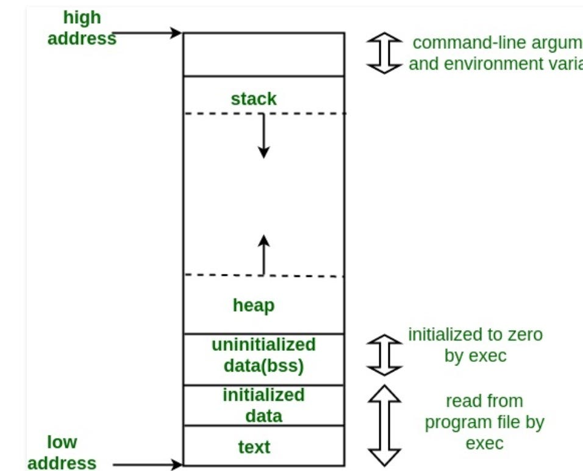

## ASSEMBLY Tutorial

1. อาศัยการดูจาก YOUTUBE https://www.youtube.com/watch?v=U9HXtrDwxVM&list=PLmxT2pVYo5LB5EzTPZGfFN0c2GDiSXgQe

2. และถาม copilot  

## Bootloaders (Real Mode)

```asm
[org 7c00h]            ; BIOS will load us to this address
mov ax, 0b800h         ; Console memory is at 0xb8000
                        ; set up a segment
mov es, ax             ; for the start of the console text.
;
; Let's clear the screen....
;
xor di, di             ; Start at beginning of screen
mov cx, 80*25          ; Number of chars in the screen
mov al, ' '            ; Space character
mov ah, 0fh            ; Color (white on black)
repne stosw            ; Copy!


mov byte [es:0], 'H'   ; Write an 'H'
mov byte [es:1], 08ch


sleep:
hlt                    ; Halts CPU until the next external
                        ;interrupt is fired
jmp sleep              ; Loop forever

times 510-($-$$) db 0  ; Pad to 510 bytes
dw 0aa55h              ; Add boot magic word to mark us
                        ; as bootable
```

- DOS (Disk Operating System), like MS-DOS, runs in **real mode**. This is because DOS was designed for early x86 processors, such as the Intel 8086 and 8088, which only supported real mode. Here's a quick breakdown:

### Why DOS Runs in Real Mode:

1. **16-Bit Architecture**:
    
    - DOS operates in real mode, limited to the 16-bit architecture of the early x86 processors.
        
    - It can address only the first 1 MB of memory (known as the "real mode memory limit").
        
2. **Direct Hardware Access**:
    
    - In real mode, programs and the operating system have direct access to hardware resources like disk drives, memory, and video output without any protection or abstraction.
        
3. **No Advanced Features**:
    
    - Real mode lacks features like memory protection, multitasking, and virtual memory, which are characteristics of protected mode.

## Assembly สำหรับ Linux ยังไม่เป็น real mode
- **Real Mode**:
    
    - Used by the BIOS and initial stages of bootloaders.
        
    - Limited to 1 MB of memory and doesn't support advanced features like virtual memory.
        
    - If you're writing assembly for bare-metal (like bootloaders or OS kernels before transitioning to protected mode), you'll be working in real mode.
        
- **Protected Mode**:
    
    - Linux and most modern operating systems use protected mode for their normal operation.
        
    - Linux assembly programs use protected mode features, meaning you have access to 32-bit or 64-bit registers and advanced memory management.
        
    - To run assembly on Linux, you typically interact with the operating system through **system calls**, which are executed in protected mode.

## ตามปกติ assembly จะต้องขึ้นต้นด้วย

- `section .text` The `.text` section is where the executable code resides, such as instructions for the processor to execute. Assemblers and linkers treat this section as the code segment.

```asm
section .text
	global _start
```

- ถ้าประกาศตัวแปรพร้อมกับค่าเริ่มต้นจะใส่ใน `section .data`

```asm
section .data
```

- ถ้าประกาศตัวแปรเฉยๆ จะใส่ใน `section .bss`

```asm
section .bss
buffer resb 256   ; Reserve 256 bytes for a buffer
counter resd 1    ; Reserve 1 double word (4 bytes) for a counter
```

- แต่ nasm ไม่ได้สนใจ `section .text` ดังนั้น nasm จะไปสนใจ `global _start` เลย

```asm
global _start

```


1. `global` **Directive:** 
	- This tells the assembler that the following label (in this case, `_start`) is something that can be accessed by external files, like the linker. It essentially makes the `_start` label a global symbol.
2.  `_label` **Label:** 
	- `_start` is commonly used as the entry point of an assembly program. It's where the execution begins. By convention, when you create an assembly program, you define this label, and the linker expects it.

```asm
global _start
_start:
    mov eax, 1
    mov ebx, 42
    sub ebx, 29
    int 0x80
```

1. เป็นการเรียกใช้ system call ที่ชื่อว่า `exit` โดยการ assign `1` ให้กับ register `eax`
2. เป็นการบอกว่า system call ที่ชื่อว่า `exit` นี้จะ return ค่าอะไรออกมา ซึ่ง return `42` ออกมา
3. `sub` คือการลบค่า ดังนั้น `sub ebx, 29` จะได้ `13` เป็นค่าที่ return ออกมา
4. `int 0x80` เป็นการเรียกใช้ software interrupt ดังนั้น kernel จึงจะอ่านค่าจาก `eax` และ `ebx` 

```bash
nasm -f elf32 ex1.asm -o ex1.o
```
1. `nasm` เป็นตัวแปลงภาษา assembly (human-readable low-level instructions) into machine code
2. `-f elf32` This specifies the output format of the object file as 32-bit ELF (Executable and Linkable Format). ELF is commonly used on Linux systems.
3. `ex1.asm` This is the input file, which contains your assembly code.
4. `-o ex1.o` This specifies the output file name as `ex1.o`, the object file that will be generated


```bash
ld -m elf_i386 ex1.o -o ex1
```

- `ld`: Invokes the linker to combine the object file and any necessary libraries into a single executable file.
    
- `-m elf_i386`: Specifies the target as 32-bit ELF format (important for 32-bit programs). If you're on a 64-bit system, this ensures compatibility for running 32-bit code.
    
- `ex1.o`: The input object file created by NASM during the assembly step.
    
- `-o ex1`: Specifies the name of the final output executable (`ex1`).

```bash
./ex1
```

1. เวลารันโปรแกรมออกมา มันจะไม่ขึ้นอะไรบนจอ

```bash
echo $?
```

1. คำสั่งนี้จะทำให้รู้ว่า exit status ของคำสั่งล่าสุดคืออะไร จะใช้ใน unix กับ linux

## อันนี้คือตาราง system call

- for 32bit

| **System Call** | **Purpose**                                 |
| --------------- | ------------------------------------------- |
| `read`          | Reads data from a file descriptor.          |
| `write`         | Writes data to a file descriptor.           |
| `open`          | Opens a file and returns a file descriptor. |
| `close`         | Closes an open file descriptor.             |
| `fork`          | Creates a new process.                      |
| `execve`        | Executes a program.                         |
| `exit`          | Terminates a process.                       |
| `wait`          | Waits for child process termination.        |
| `mmap`          | Maps files or devices into memory.          |
| `brk`           | Changes the memory allocation of a process. |
| `ioctl`         | Manipulates I/O device parameters.          |
| `socket`        | Creates a socket.                           |
| `bind`          | Assigns an address to a socket.             |
| `listen`        | Listens for socket connections.             |
| `accept`        | Accepts a socket connection.                |
## อันนี้จะมีรหัส system call ที่เรียกใช้ผ่าน eax

| **System Call** | **EAX Number** |
| --------------- | -------------- |
| `exit`          | 1              |
| `fork`          | 2              |
| `read`          | 3              |
| `write`         | 4              |
| `open`          | 5              |
| `close`         | 6              |
| `waitpid`       | 7              |
| `execve`        | 11             |
| `chdir`         | 12             |
| `brk`           | 45             |
| `mmap`          | 90             |
| `ioctl`         | 54             |
| `socket`        | 102            |
| `bind`          | 104            |
| `accept`        | 107            |

## register ตัวอื่นๆทำหน้าที่อะไรบ้าง

- 32bit

| **Register** | **Purpose**                                                |
| ------------ | ---------------------------------------------------------- |
| `eax`        | Contains the syscall number.                               |
| `ebx`        | Holds the first argument to the system call.               |
| `ecx`        | Holds the second argument to the system call.              |
| `edx`        | Holds the third argument to the system call.               |
| `esi`        | Holds the fourth argument to the system call.              |
| `edi`        | Holds the fifth argument to the system call.               |
| `ebp`        | Holds the sixth argument to the system call (rarely used). |
- 64bit จะมีวิธีการที่เปลี่ยนไป  โดยการเรียกใช้ interrupt จะเปลี่ยนคำสั่ง จาก `int 0x80` เป็น `syscall`

| **Register** | **Purpose**                  |
| ------------ | ---------------------------- |
| `rax`        | Contains the syscall number. |
| `rdi`        | First argument.              |
| `rsi`        | Second argument.             |
| `rdx`        | Third argument.              |
| `r10`        | Fourth argument.             |
| `r8`         | Fifth argument.              |
| `r9`         | Sixth argument.              |
## Operator

```asym
mov ebx, 123    ; ebx = 123
mov eax, ebx    ; eax = ebx
add ebx, ecx    ; ebx += ecx
sub ebx, edx    ; ebx -= edx
mul ebx         ; eax *= ebx
div edx         ; eax /= edx
```
## การใช้ system call เบอร์ 4 (write)

```asm
global _start

section .data
    msg db "Hello, world!", 0x0a ;0x0a means newline
    len equ $ - msg

section .text
_start:
    mov eax, 4 ; sys_write system call
    mov ebx, 1 ; stdout file descriptor
    mov ecx, msg ; bytes to write
    mov edx, len ; number of bytes to write
    int 0x80 ; perform system call

    mov eax, 1 ; sys_exit system call
    mov ebx, 0 ; exit status is 0
    int 0x80 ; perform system call
```

## การใช้ jmp

```asm
global _start

_start:
    mov ebx, 42 ; exit status is 42
    mov eax, 1 ; sys_exit system call
    jmp skip ; jump to `skip` label
    mov ebx, 13 ; exit status is 13
skip:
    int 0x80 ; perform system call
```

- ใช้ condition

```asm
global _start

_start:
    mov ecx, 99 ; set ecx to 99
    mov ebx, 42 ; exit status is 42
    mov eax, 1 ; sys_exit system call
    cmp ecx, 100 ; compare ecx to 100
    jl skip ; jump if less than
    mov ebx, 13 ; exit status is 13
skip:
    int 0x80 ; perform system call
```

```bash
echo $? # 42
```

```asm
global _start

_start:
    mov ecx, 101 ; set ecx to 99
    mov ebx, 42 ; exit status is 42
    mov eax, 1 ; sys_exit system call
    cmp ecx, 100 ; compare ecx to 100
    jl skip ; jump if less than
    mov ebx, 13 ; exit status is 13
skip:
    int 0x80 ; perform system call
```

```bash
echo $? # 13
```

```asm
je A ; Jump if Equal
jne A ; Jump if Not Equal
jg A ; Jump if Greater
jge A ; Jump if Greater or Equal
jl A ; Jump if Less
jle A ; Jump if Less or Equal
```

```asm
global _start
section .text
_start:
	mov ebx, 1     ;  start ebx at 1
	mov ecx, 4     ;  number of iterations
label:
	add ebx, ebx   ;  ebx += ebx
	dec ecx        ;  ecx -= 1
	cmp ecx, 0     ;  compare ecx with 0
	jg label       ;  jump to label if greater
	mov eax, 1     ;  sys_exit system call
	int 0x80
```

```bash
echo $? 16
```

## Replace byte

```asm
global _start
section .data
    addr db "yellow", 0x0d, 0x0a
section .text
_start:
    mov [addr], byte 'H'
    mov [addr+5], byte '!'
    mov eax, 4
    mov ebx, 1
    mov ecx, addr
    mov edx, 8
    int 0x80
    mov eax, 1
    mov ebx, 0
    int 0x80
```

```bash
Hello!
```

## Extendable Stack Pointer

{/*  */}


- top ของตัว stack จะอยู่บนสุดนั่นก็คือตำแหน่ง memory ที่น้อยกว่า

```asm
global _start
_start:
    sub esp, 6
    mov [esp], byte 'H'
    mov [esp+1], byte 'e'
    mov [esp+2], byte 'y'
    mov [esp+3], byte '!'
    mov [esp+4], byte 0x0d
    mov [esp+5], byte 0x0a
    mov eax, 4
    mov ebx, 1
    mov ecx, esp
    mov edx, 6
    int 0x80

    mov eax, 1
    mov ebx, 0
    int 0x80
```

```bash
Hey!
```

## call

```asm
global _start
_start:
    call func
    mov eax, 1
    int 0x80

func:
    mov ebx, 42
    pop eax
    jmp eax
```

1. การ call func จะเป็นการ push stack ของคำสั่งถัดไปเก็บเอาไว้ใน stack (mov eax, 1) แล้วกระโดดไป label func
2. mov ebx, 42 เป็นการเก็บค่า 42 ใส่ใน ebx
3. pop eax จะเป็นการลบคำสั่งออกจาก stack แล้วเก็บไว้ใน eax
4. mov eax,1 เก็บค่า 1 ใส่ใน eax
5. int 0x80 เป็นการเรียก system call

ซึ่งการใช้ call แล้วมีการ pop eax และ jmp eax ก็คือแทนการใช้คำสั่ง ret ซึ่งผลลัพธ์ที่ได้มีค่าเท่ากัน

```asm
global _start
_start:
    call func
    mov eax, 1
    int 0x80

func:
    mov ebx, 42
    ;pop eax
    ;jmp eax
    ret
```

## การใช้ prologue กับ epilogue เกี่ยวกับ subroutine

- ซึ่ง จะเก็บตำแหน่งในของ subroutine ใน base pointer

```c
int myFunction(int a, int b){
	int c = a + b;
	return c;
}
```

```asm
push ebp       ; Prologue: เก็บค่า Base Pointer เดิม
mov ebp, esp   ; ตั้งค่า Base Pointer ใหม่
sub esp, 4     ; สงวนพื้นที่สำหรับตัวแปร c

mov eax, [ebp+8]  ; โหลดค่า a
add eax, [ebp+12] ; เพิ่มค่า b
mov [ebp-4], eax ; เก็บผลลัพธ์ลงในตัวแปร c

mov eax, [ebp-4] ; นำค่าของ c มาเก็บใน EAX เพื่อส่งกลับ
mov esp, ebp    ; Epilogue: คืนค่า Stack Pointer
pop ebp         ; คืนค่า Base Pointer เดิม
ret             ; กลับไปยังผู้เรียก
```

## ตัวอย่าง

```asm
global _start
_start:
push 2        ; b
push 1        ; a

call func
mov ebx, eax
mov eax, 1
int 0x80

func:
    ; prologue
    push ebp
    mov ebp, esp
    sub esp, 4

    mov eax, [ebp+8]
    add eax, [ebp+12]
    mov [ebp-4], eax
    mov eax, [ebp-4]

    ; epilogue
    mov esp, ebp
    pop ebp
    ret
```

- ถ้าไม่ใช้ ret
```asm
global _start
_start:
push 2        ; b
push 3        ; a

call func
mov ebx, eax
mov eax, 1
int 0x80

func:
    ; prologue
    push ebp
    mov ebp, esp
    sub esp, 4

    mov eax, [ebp+8]
    add eax, [ebp+12]
    mov [ebp-4], eax
    mov eax, [ebp-4]

    ; epilogue
    mov esp, ebp
    pop ebp
    ;ret
    pop ebx   ; เพราะเวลาคืนกลับมาจะต้องมาที่ register ebx ต่อ
    jmp ebx
```

- ตัวอย่างนี้ เรียกใช้ function โดยการส่งค่า parameter ตัวเดียว

```asm
global _start

_start:
    push 21
    call times2
    mov ebx, eax
    mov eax, 1
    int 0x80
times2:
    push ebp
    mov ebp, esp
    mov eax, [esp+8]
    add eax, eax
    mov esp, ebp
    pop ebp
    ret
```

- times2 ถือว่าเป็น subroutine

### Why `[esp+8]` in this code?

When the `times2` subroutine is called, two things are pushed onto the stack:

1. The **return address** (4 bytes): This is where the program should resume execution after the subroutine completes.
    
2. The **argument value** `21` (4 bytes): This is the value passed to the `times2` function via the stack (using `push 21`).
    

At the start of the `times2` function:

- `esp` points to the saved return address.
    
- `[esp+4]` would refer to the return address itself.
    
- `[esp+8]` is used to access the value `21`, which is the first argument passed to the function.

- ที่ offset เป็น 4 เพราะมันเป็น stack ของ 32 bytes ดังนั้น 1 ชั้นคือ 4 bytes

## ตัวอย่าง

```asm
global main
extern printf

section .data
msg db "Testing %i...", 0x0a, 0x00

section .text
main:
    push ebp
    mov ebp, esp
    sub esp, 4

    push 123
    push msg
    call printf
    add esp, 8
    mov eax, 0

    mov esp, ebp
    pop ebp
    ret
```

### What Does `add esp, 8` Do?

The instruction **adjusts the stack pointer (**`esp`**)** to remove data that was previously pushed onto the stack.

### Why is it Needed?

When you push arguments onto the stack (like the format string and integer for `printf`), they occupy space in memory. After the function call (e.g., `call printf`), it's your responsibility to clean up this space to restore the stack to its previous state.

In your case, you pushed **two items** onto the stack:

1. The **format string** `msg` (4 bytes).
    
2. The **integer** `123` (4 bytes).
    

That's a total of **8 bytes**. After the `printf` function finishes execution, these 8 bytes are no longer needed, so you remove them from the stack by adding `8` to `esp`:

- `add esp, 8`: Moves the stack pointer up by 8 bytes, effectively cleaning up the space used by the two arguments.
    

### Why Not Use `pop` Instead?

You could technically use `pop` instructions to remove the arguments, but that would be less efficient in this case. For example:

```asm
pop eax    ; Remove 123
pop msg    ; Remove msg
```

This works, but `add esp, 8` is a faster and simpler way to clean up multiple stack entries in one go.

- ต้องติดตั้ง 
```bash
sudo apt-get install libc6-dev
sudo apt-get install gcc-multilib
```

- ตอน compile
```bash
nasm -f elf32 -o ex10.o ex10.asm
gcc -m32 -o ex10 ex10.o
```

- ผลลัพธ์ที่ได้
```bash
Testing 123...
```


## การเขียนฟังก์ชั่นใน assembly แล้วไปเรียกใช้ใน C

```asm
// add42.asm
global add42

add42:
    push ebp
    mov ebp, esp
    mov eax, [ebp+8]
    add eax, 42
    mov esp, ebp
    pop ebp
    ret
```

```bash
nasm -f elf32 -o add42.o add42.asm
```

```c
// add42.h
int add42(int x);
```

```c
// main.c
#include <stdio.h>
#include "add42.h"

int main(){
    int result = 0;
    result = add42(30);
    printf("Result: %i\n",result);
    return 0;
}
```

- compile
```bash
gcc -m32 add42.o main.c -o ex11
```

